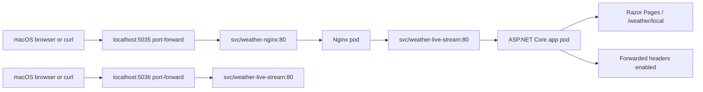

# Current System Architecture

This is the current local setup for the weather service on macOS + OrbStack + kind.

## ASCII View

```text
   macOS
   browser / curl
         |
         v
 +------------------------+
 | localhost:5035         |
 | kubectl port-forward   |
 | (screen session)       |
 +-----------+------------+
             |
             v
 +-----------+------------+
 | weather-nginx          |
 | Nginx reverse proxy    |
 | svc/weather-nginx:80   |
 +-----------+------------+
             |
             v
 +-----------+------------+
 | weather-live-stream    |
 | ASP.NET Core 10 app    |
 | svc/weather-live-stream|
 +-----------+------------+
             |
             v
 +-----------+------------+
 | app pod on kind        |
 | Razor Pages + /weather |
 | Forwarded headers on   |
 +------------------------+

Direct debug path:

   macOS browser / curl
         |
         v
 +------------------------+
 | localhost:5036         |
 | kubectl port-forward   |
 +-----------+------------+
             |
             v
 +------------------------+
 | svc/weather-live-stream|
 | direct app access      |
 +------------------------+
```

## Flowchart View



## Excalidraw Layout

Use these boxes and arrows if you redraw it in Excalidraw:

1. `macOS browser / curl`
2. `localhost:5035 kubectl port-forward`
3. `weather-nginx`
4. `weather-live-stream`
5. `kind cluster`

Draw a second smaller path for direct debugging:

1. `localhost:5036 kubectl port-forward`
2. `weather-live-stream`

## What Each Layer Does

- `kubectl port-forward` is the only host-facing entry point.
- `weather-nginx` is the reverse proxy that handles localhost traffic.
- `weather-live-stream` is the ASP.NET Core app pod.
- The app trusts forwarded headers only when `ReverseProxy__Enabled=true`.
- Nginx adds the proxy headers and passes traffic to the app service.

